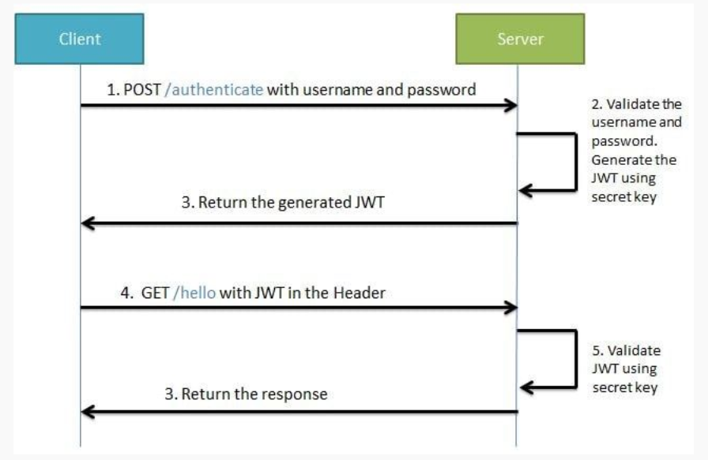

## Instruções:

Definir o que é JWT, suas utilizações e o seu modo de funcionamento.

Criar um passo a passo de uma requisição que utiliza o JWT.

Gerar um JWT de exemplo que possa ser lido e utilizado por um programa.

JWT (JSON Web Token) é utilizado para criar segurança de APIs Rest.

O JWT pode ser divido em três partes:

1. Header: traz informações sobre o algoritmo utilizado para a criptografia do Token e o seu tipo;
2. Payload: traz o conteúdo da autenticação (usuário e senha);
3. Assinatura: traz a assinatura que irá validar o JWT.

O JWT funciona da seguinte forma:
- O desenvolvedor da aplicação define quais rotas devem ser protegidas pelo JWT;
- Para que o usuário possa acessar estas rotas, ele deverá fazer o login no sistema;
- O servidor irá receber a tentativa de login e irá validar se as credenciais do usuário são válidas. Se forem válidas, ele irá responder com um Bearer token.
- Então, utilizando este Bearer Token no Header das suas requisições, o usuário poderá acessar os endpoint que estão segurados pelo JWT.

